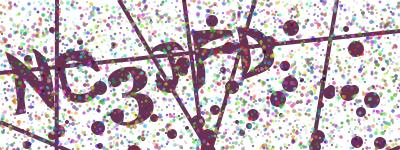

<h1 align="center">Captcha Generator</h1>

Captcha Generator is a Node library for quickly and easily generating captcha images. Forked from [HaileyBot/captcha-generator](https://github.com/HaileyBot/captcha-generator) for colorful alphanumeric captchas.



## Installation

Use the package manager [npm](https://www.npmjs.com/) to install Captcha Generator

```bash
npm i captcha-generator-alphanumeric
```

## Usage

### Basic

```js
// Import the module
const Captcha = require("captcha-generator-alphanumeric").default;

// Create a new Captcha object
//  - Optional argument to specify image height (250 to 400px, default 250)
//    - Image width is 400px
//  - Returned object will contain 4 properties
//    - "PNGStream" is a stream object for the image file in PNG format
//    - "JPEGStream" is a stream object for the image file in JPEG format
//    - "dataURL" is a data URL containing the JPEG image data
//    - "value" is the 6 character code the image contains
let captcha = new Captcha();
console.log(captcha.value);
```

### Save to file example

```js
const path = require("path"),
	fs = require("fs"),
	Captcha = require("captcha-generator-alphanumeric").default;

let captcha = new Captcha();
captcha.PNGStream.pipe(fs.createWriteStream(path.join(__dirname, `${captcha.value}.png`)));
captcha.JPEGStream.pipe(fs.createWriteStream(path.join(__dirname, `${captcha.value}.jpeg`)));
```

### Discord Example

This example assumes you already have the core framework of a Discord Bot set up

```js
const Captcha = require("captcha-generator-alphanumeric").default;

// Use this function for blocking certain commands or features from automated self-bots
function verifyHuman(msg) {
	let captcha = new Captcha();
	msg.channel.send(
		"**Enter the text shown in the image below:**",
		new Discord.MessageAttachment(captcha.JPEGStream, "captcha.jpeg")
	);
	let collector = msg.channel.createMessageCollector(m => m.author.id === msg.author.id);
	collector.on("collect", m => {
		if (m.content.toUpperCase() === captcha.value) msg.channel.send("Verified Successfully!");
		else msg.channel.send("Failed Verification!");
		collector.stop();
	});
}
```

## License

This project is licensed under [GPL-3.0](https://github.com/pulsejet/captcha-generator-alphanumeric/blob/master/LICENSE.md)
